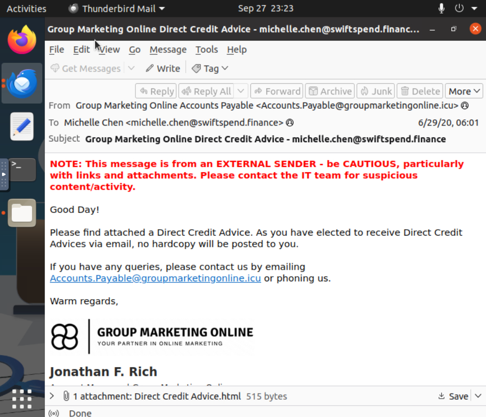
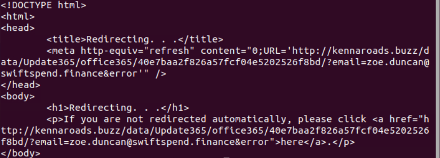
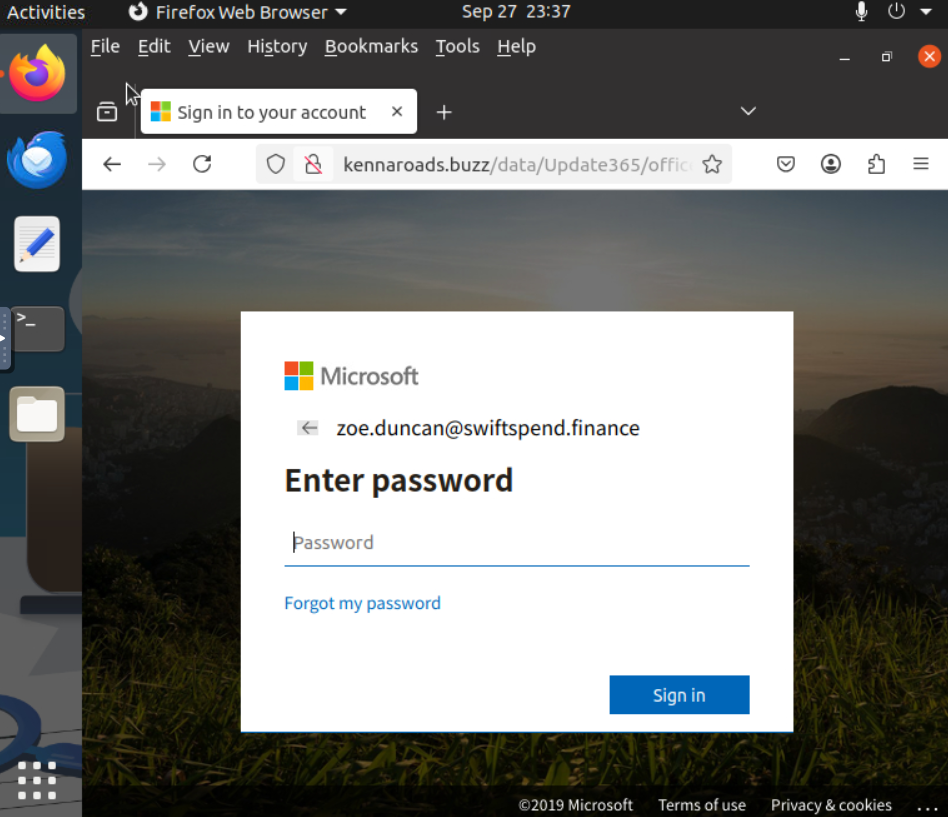
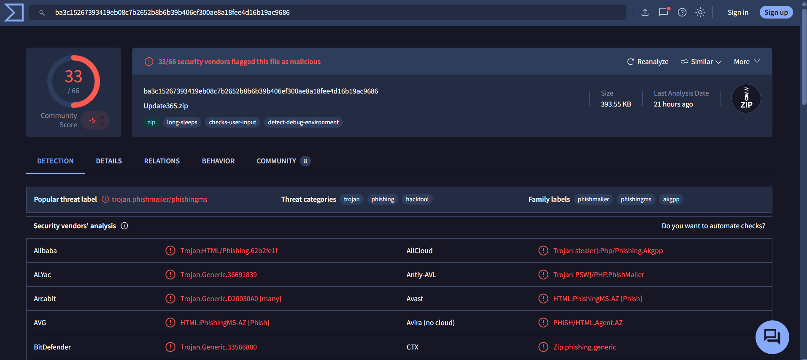
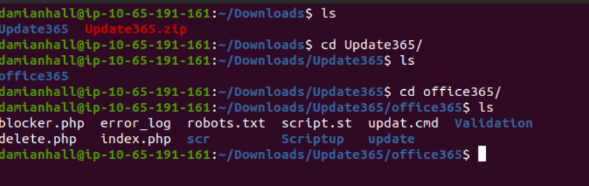
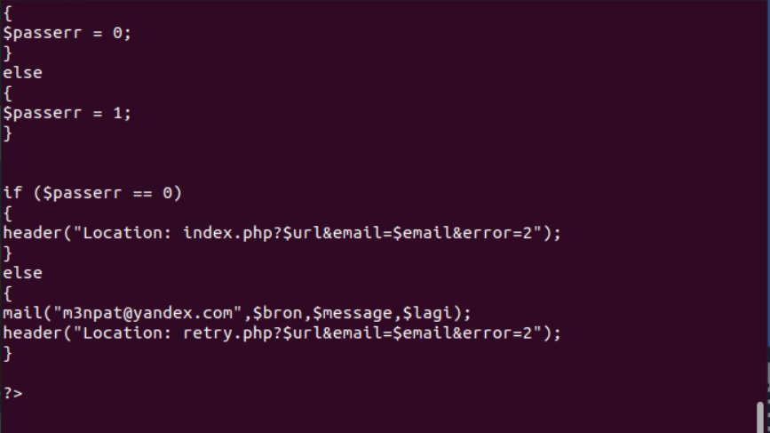
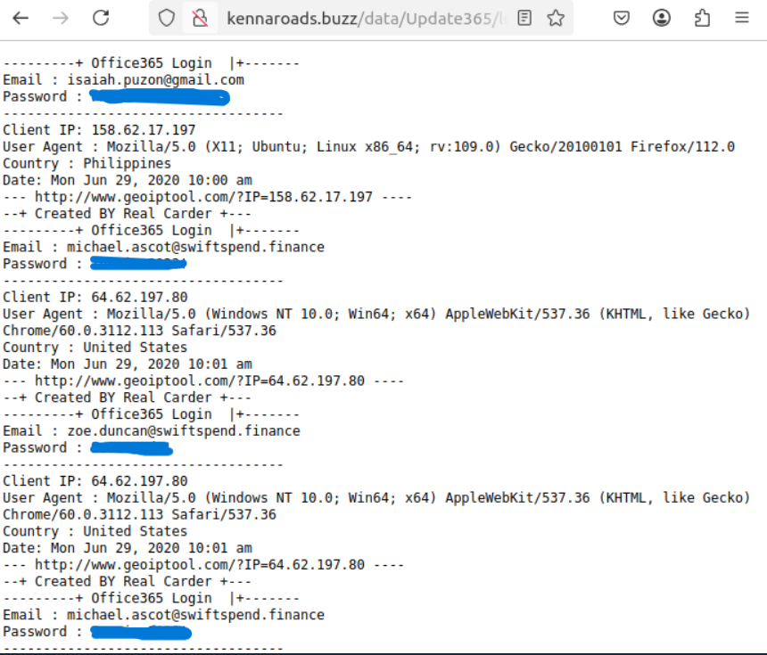

# Incident Report: Snapped Phishing Line

## Metadata

| Field | Value |
|-------|-------|
| Date | 2026-09-27 |
| Analyst | Logan J. |
| Severity | High |
| Platform | TryHackMe |
| Room/Scenario | SOC L1 Path - Snapped Phishing Line |
| Status | Closed |

## Executive Summary

Five phishing emails from a single external sender, `Accounts.Payable@groupmarketingonline[.]icu`, were delivered to five Swiftspend Finance employees. Four carried a "Direct Credit Advice" HTML attachment that redirected the recipient to a counterfeit Microsoft 365 login page hosted on `kennaroads[.]buzz`. The fifth used a different method in a PDF attachment containing a quote for services.

The attacker left their phishing kit and its credential log publicly exposed on the same site. The log confirms that all four recipients of the Direct Credit Advice email submitted their credentials. The kit's source code shows captured credentials were also emailed to an attacker-controlled mailbox.

All four accounts should be treated as compromised. Priority actions are credential resets with session revocation, sign-in log review, and a check for mailbox rules.

## Timeline of Events

| Timestamp (as recorded) | Event | Source |
|-------------------------|-------|--------|
| 2020-06-29 06:01 | Direct Credit Advice email delivered | Email client |
| 2020-06-29 10:00 | Credential submission from non-Swiftspend address `isaiah.puzon@gmail[.]com` | Kit credential log |
| 2020-06-29 10:01 | Credential submission: M. Ascot | Kit credential log |
| 2020-06-29 10:01 | Credential submission: Z. Duncan | Kit credential log |
| 2020-06-29 10:02 | Credential submission: M. Ascot (second submission) | Kit credential log |
| Timestamp not provided | Credential submission: D. Marshall | Kit credential log |
| Timestamp not provided | Credential submission: M. Chen | Kit credential log |

## Indicators of Compromise

| Type | Value | Context |
|------|-------|---------|
| Email Address | `Accounts.Payable@groupmarketingonline[.]icu` | Sender of all five phishing emails |
| Domain | `groupmarketingonline[.]icu` | Sender domain |
| Domain | `kennaroads[.]buzz` | Hosts the fake login page, the exposed kit, and the credential log |
| URL | `hxxp://kennaroads[.]buzz/data/Update365/office365/40e7baa2f826a57fcf04e5202526f8bd/?email=<recipient>&error` | Redirect target embedded in the HTML attachment |
| URL | `hxxp://kennaroads[.]buzz/data/Update365/log.txt` | Publicly exposed credential log |
| File Name | `Direct Credit Advice.html` (515 bytes) | Attachment on four emails; likely personalized per recipient (Analysis) |
| File Name | `Quote.pdf` | Attachment on the fifth email |
| File Hash (SHA256) | `ba3c15267393419eb08c7b2652b8b6b39b406ef300ae8a18fee4d16b19ac9686` | `Update365.zip` phishing kit (393.55 KB, 49 files) |
| Email Address | `m3npat@yandex[.]com` | Credential collection mailbox, hardcoded in `submit.php` |
| String | `Created BY Real Carder` | Kit signature written into each credential log entry |

## Affected Systems

| User | Received | Credentials Submitted | Source IP (from kit log) |
|------|----------|-----------------------|--------------------------|
| michael.ascot@swiftspend[.]finance | Direct Credit Advice | Yes (twice) | 64.62.197[.]80 |
| zoe.duncan@swiftspend[.]finance | Direct Credit Advice | Yes | 64.62.197[.]80 |
| derick.marshall@swiftspend[.]finance | Direct Credit Advice | Yes | Not recorded |
| michelle.chen@swiftspend[.]finance | Direct Credit Advice | Yes | Not recorded |
| william.mcclean@swiftspend[.]finance | Quote for Services | Not observed in kit log | N/A |

The Ascot and Duncan submissions were made from Windows 10 hosts running Chrome 60.0.3112.113.

## Analysis

### Delivery

All five emails came from `Accounts.Payable@groupmarketingonline[.]icu`. The four Direct Credit Advice emails pose as a payment notice and aim to push the recipient to the attachment. The mail client's external-sender banner was present, but the messages were still delivered.

Email authentication (SPF) results varied across relay hops, with some passing and some failing.

### Redirect Attachment

`Direct Credit Advice.html` contains no script. It is a redirect that sends the browser to the attacker's login page, with a fallback link if it fails. The recipient's email address is hardcoded into the redirect URL as a query parameter, which pre-fills the address on the fake login page so it looks more like a re-authentication prompt.

This suggests the attachments were personalized per recipient. This could also mean that a single file hash would not match all four attachments, due to them being personalized across users.

### Credential Harvesting Page

The redirect lands on a counterfeit Microsoft 365 "Enter password" page served over plain HTTP from `kennaroads[.]buzz`.

### Exposed Phishing Kit

Browsing the `/data` directory showed the attacker's kit archive, `Update365.zip`, available for download. VirusTotal flagged it on 33 of 66 engines, with threat categories trojan, phishing, and hacktool, and family labels `phishmailer`, `phishingms`, and `akgpp`. The archive holds 49 files: PHP handlers, the login page assets, and a `Validation/submit.php` credential handler.

`submit.php` sends captured credentials to `m3npat@yandex[.]com` using PHP's `mail()` function.

The forged page hangs upon submission until it eventually returns an HTTP 504 Gateway Timeout response (tested manually). The kit also redirects the victim to retry.php after capture. These behaviors may have contributed to M. Ascot submitting their credentials twice.

### Exposed Credential Log

The kit also wrote every submission to `/data/Update365/log.txt`, which was publicly readable. Each entry records email, plaintext password, client IP, user agent, country, and timestamp. The log confirms submissions from all four Direct Credit Advice recipients. W. McClean does not appear, which is consistent due to receiving a different method of attack.

The attacker stored the credentials in two places, that being the Yandex mailbox and a world-readable log. Anyone who found the log could also use the credentials, not only the original attacker.

In the logs, there is also a non-Swiftspend address. The explanation for this is not entirely clear, although it could mean the kit was used in other campaigns, or this was the adversary testing their set-up. The actual reason is unknown.

### MITRE ATT&CK Mapping

| Tactic | Technique | Observation |
|--------|-----------|-------------|
| Resource Development (TA0042) | T1583.001 Acquire Infrastructure: Domains | `groupmarketingonline[.]icu` and `kennaroads[.]buzz` |
| Resource Development (TA0042) | T1608.005 Stage Capabilities: Link Target | Fake Microsoft 365 page hosted on `kennaroads[.]buzz` |
| Initial Access (TA0001) | T1566.001 Phishing: Spearphishing Attachment | HTML redirect attachment |
| Credential Access (TA0006) | T1056.003 Input Capture: Web Portal Capture | Credentials captured by the fake login page |

## Containment & Recovery

1. Reset passwords for M. Ascot, Z. Duncan, D. Marshall, and M. Chen, and revoke active sessions and refresh tokens so existing sign-ins are invalidated.
2. Review Microsoft 365 sign-in logs on all four accounts for sign-ins from unfamiliar IPs or countries, MFA method changes, and new app consents.
3. Check all four mailboxes for suspicious inbox rules.
4. Block `kennaroads[.]buzz` and `groupmarketingonline[.]icu` at DNS + any proxies, and block the sender address and domain at the mail gateway.
5. Search mail logs for any other recipients of mail from `groupmarketingonline[.]icu` and remove the messages from all mailboxes.

## Recommendations

**Controls**

- Quarantine or strip `.html` and `.htm` attachments from external senders at the gateway. 
- Enforce phishing-resistant MFA (FIDO2 or passkeys) for Microsoft 365. A captured password alone would then not grant access.
- Run targeted awareness training for finance staff on payment-themed attempts, as the external-sender banner was present on these emails but did not stop them.

**Reporting**

- Report `kennaroads[.]buzz` to its registrar and hosting provider, and `m3npat@yandex[.]com` to Yandex abuse.

## Evidence Appendix

### E1: Phishing email (M. Chen)

### E2: HTML attachment source showing hardcoded redirect

### E3: Counterfeit Microsoft 365 login page with pre-filled recipient address

### E4: VirusTotal detection for Update365.zip

### E5: Extracted phishing kit contents

### E6: submit.php credential exfiltration to attacker mailbox

### E7: Exposed credential log (passwords redacted)

