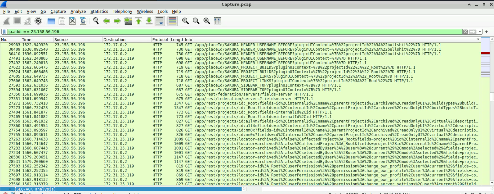
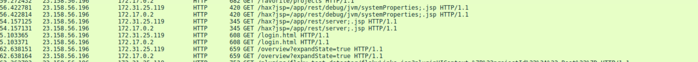
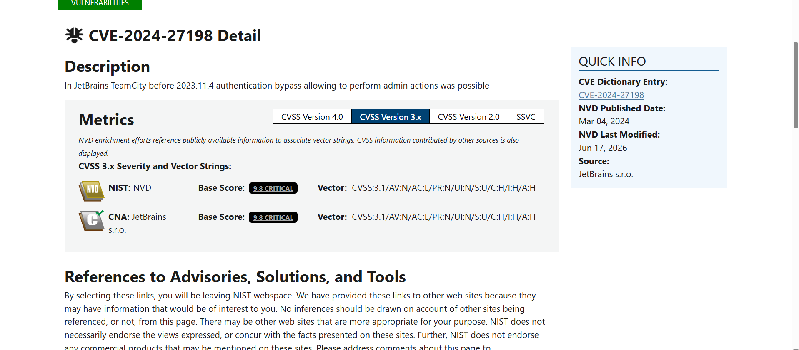
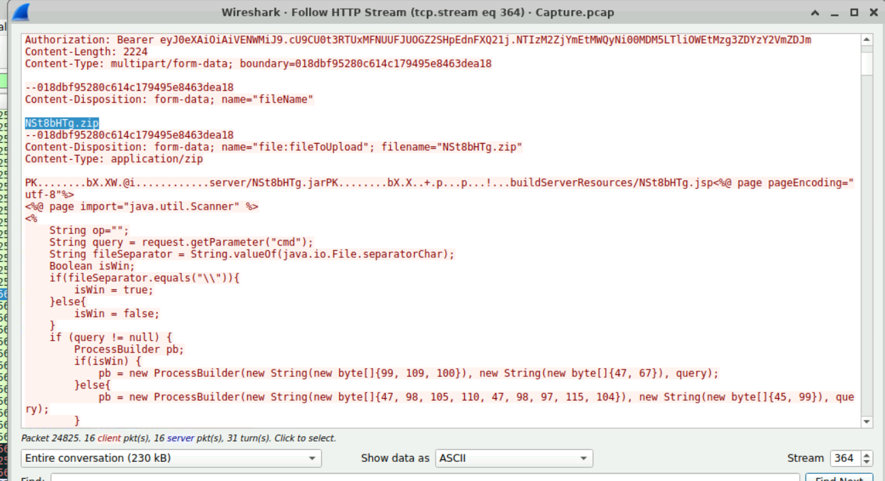
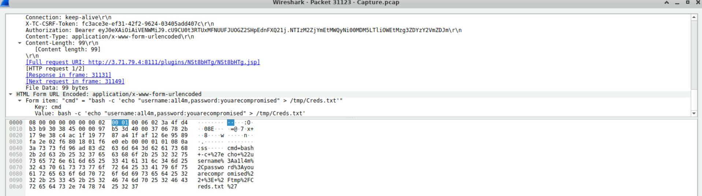
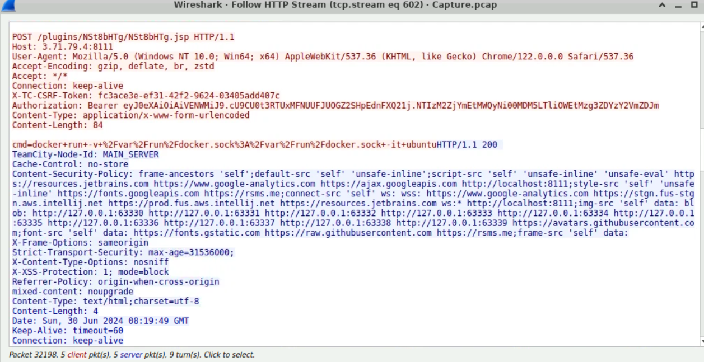
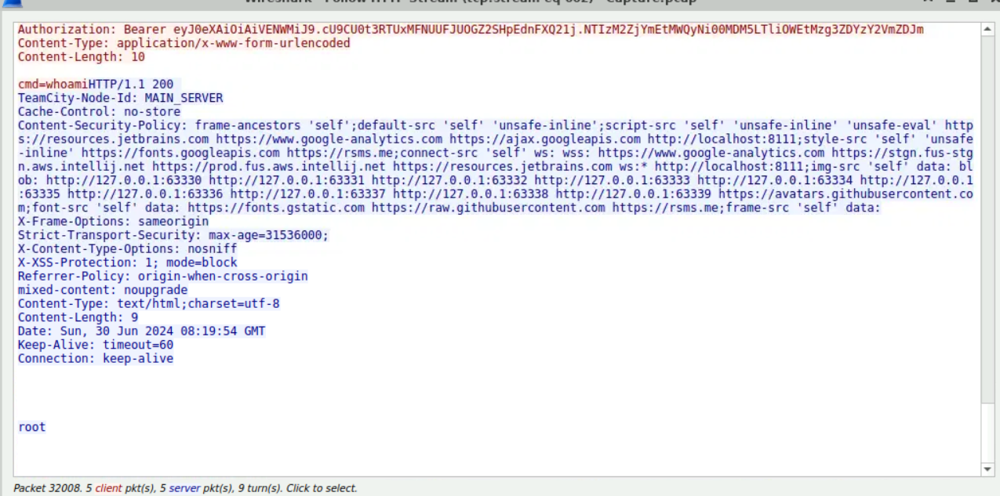

# Incident Report: JetBrains TeamCity Compromise (CVE-2024-27198)

## Metadata

| Field | Value |
|-------|-------|
| Date | 2026-09-30 |
| Analyst | Logan J. |
| Severity | Critical |
| Platform | CyberDefenders |
| Room/Scenario | JetBrains Lab (Network Forensics) |
| Tools | Wireshark |
| Status | Closed |
| Room Status | Retired |

## Executive Summary

A public-facing JetBrains TeamCity server running version 2023.11.3 was compromised through CVE-2024-27198, an authentication bypass fixed in 2023.11.4.

An external attacker (23.158.56[.]196) exploited the vulnerability to gain administrative access, created an account, and uploaded a web-shell.

Through the web-shell, the attacker obtained arbitrary command execution and later executed whoami, which returned root, following Docker-based host-access activity.

Severity is rated Critical because an unauthenticated remote attacker reached root-level command execution and administrative control of a CI server.

## Methodology

1. Reviewed HTTP traffic in Wireshark and identified a high volume of requests from 23.158.56[.]196 to 172.31.25[.]119 and 172.17.0[.]2, hitting API, login, and application paths in short intervals. The response header `TeamCity-Node-Id: MAIN_SERVER` confirmed the 172.x addresses as the TeamCity server.
2. Applied `ip.addr == 23.158.56.196` and sorted by the Info column, grouping requests by endpoint, revealing repeated REST API enumeration and requests using an unusual `/hax?jsp=...;.jsp` path pattern (E1, E2).
3. Identified the server version as 2023.11.3 and matched it to CVE-2024-27198 via NVD (E3).
4. Followed the HTTP stream of a POST to the plugin upload endpoint, revealing the upload of `NSt8bHTg.zip`, which contained a JSP webshell (E4).
5. Searched for the deployed form of the .zip and found requests to `/plugins/NSt8bHTg/NSt8bHTg.jsp`. Following these streams showed commands sent through a `cmd` form parameter, including `ls` and `whoami`, and the server's responses (E7).
6. Located the credential-file tampering, found the relevant command in the packet details (E5).
7. Identified the container escape attempt among the webshell commands (E7).

## Sequence of Events

| Frame | Timestamp (UTC) | Event | Evidence |
|-------|-----------------|-------|----------|
| Not captured | - | Auth-bypass requests to `/hax?jsp=/app/rest/server;.jsp` and `/hax?jsp=/app/rest/debug/jvm/systemProperties;.jsp` | E2 |
| 24825 (stream 364) | - | `NSt8bHTg.zip` uploaded via plugin upload endpoint | E4 |
| 27233 - 30410 | - | REST API enumeration of projects, permissions, and federation servers, including projects `a1l4m` and `mm0x` | E1 |
| 31123 | - | `/tmp/Creds.txt` overwritten via webshell | E5 |
| Before 32138 | - | Container escape attempt: `docker run --rm -it -v /:/host ubuntu chroot /host` | E6 |
| Stream 602 | 2024-06-30 08:19:49 | Container escape attempt: `docker run -v /var/run/docker.sock:/var/run/docker.sock -it ubuntu` |
| Stream 602 | 2024-06-30 08:19:54 | `whoami` via webshell returns `root` | E7 |

## Indicators of Compromise

| Type | Value | Context |
|------|-------|---------|
| IP Address | 23.158.56[.]196 | Attacker source |
| URI | `/hax?jsp=/app/rest/server;.jsp` | Auth-bypass request pattern |
| URI | `/hax?jsp=/app/rest/debug/jvm/systemProperties;.jsp` | Auth-bypass request pattern |
| File Name | NSt8bHTg.zip | Malicious plugin archive |
| File Path | `/plugins/NSt8bHTg/NSt8bHTg.jsp` | Deployed webshell |
| Command | `bash -c 'echo "username:a1l4m,password:youarecompromised" > /tmp/Creds.txt'` | Credential file tampering |
| Command | `docker run --rm -it -v /:/host ubuntu chroot /host` | Container escape attempt (host filesystem mount) |
| Command | `docker run -v /var/run/docker.sock:/var/run/docker.sock -it ubuntu` | Container escape attempt (Docker socket mount) |
| User Agent | `Mozilla/5.0 (Windows NT 10.0; Win64; x64) ... Chrome/122.0.0.0 Safari/537.36` | Attacker's webshell requests |

## Affected Systems

| Address | Role |
|---------|------|
| 172.31.25[.]119 | Likely the host's private address |
| 172.17.0[.]2 | Likely the TeamCity container |

## Analysis

### Initial Access: CVE-2024-27198

CVE-2024-27198 allows unauthenticated access to TeamCity endpoints. The attacker's requests take the form `/hax?jsp=/app/rest/server;.jsp`: the path ends in `.jsp`, which TeamCity's authentication check treats as a permitted resource, and routes the request to the REST endpoint. The attacker used this to query server details and system properties without credentials (E2).

### Persistence: Administrator Account and Webshell

The attacker created an administrator account and uploaded `NSt8bHTg.zip` through the plugin upload endpoint (E4). The JSP from the archive reads a `cmd` request parameter and executes it. Once deployed, it was reachable at `/plugins/NSt8bHTg/NSt8bHTg.jsp`.

### Discovery

After the upload, the attacker enumerated TeamCity through the REST API, including projects (a1l4m and mm0x), user permissions such as change_server_settings, and federation servers (E1)

Through the webshell, the attacker also executed commands such as `ls`. Following the Docker-based host escape attempts, `whoami` returned root (E7).

### Impact: Credential File Tampering

The attacker overwrote `/tmp/Creds.txt`, a file containing credentials, with attacker-controlled values (`username:a1l4m,password:youarecompromised`) (E5). This replaces the stored credentials with the attacker's.

### Container Escape Attempt

The attacker made at least two escape attempts through the webshell:

- `docker run --rm -it -v /:/host ubuntu chroot /host` (E7): mount the host's root filesystem into a new container and `chroot` into it.
- `docker run -v /var/run/docker.sock:/var/run/docker.sock -it ubuntu`: mount the Docker socket, which would give control of the host's Docker daemon.

## MITRE ATT&CK Mapping

| Tactic | Technique | Observed Activity |
|--------|-----------|-------------------|
| Initial Access | T1190 - Exploit Public-Facing Application | CVE-2024-27198 auth bypass (`;.jsp` requests) |
| Persistence | T1505.003 - Web Shell | `NSt8bHTg.jsp` deployed via malicious plugin |
| Execution | T1059.004 - Unix Shell | Commands executed via `/bin/bash -c` through the webshell |
| Discovery | T1033 - System Owner/User Discovery | `whoami` |
| Discovery | T1083 - File and Directory Discovery | `ls` |
| Impact | T1565.001 - Stored Data Manipulation | Overwrote `/tmp/Creds.txt` |
| Privilege Escalation | T1611 - Escape to Host | Docker-based host access / escape attempt |

## Impact

- **Confidentiality:** The attacker obtained access to the TeamCity instance and root-level command execution within its environment, potentially exposing source code, build configs, credentials, and other CI/CD secrets accessible to the service.
- **Integrity:** Malicious plugin installed, an attacker account added, and `/tmp/Creds.txt` overwritten. 
- **Host:** The attacker issued Docker commands intended to access the underlying host. Further logs should be reviewed to determine if host access was established.

## Containment & Recovery

1. Isolate the TeamCity server from the internet and block 23.158.56[.]196.
2. Remove the `NSt8bHTg` plugin and delete the created account.
3. Revoke all TeamCity access tokens, including the token observed in attacker requests.
4. Rebuild the TeamCity container from a known-good image at version 2023.11.4 or later, rather than cleaning the compromised instance.
5. Rotate every secret stored in or accessible to TeamCity, and the credentials that were stored in `Creds.txt`.
6. Review builds produced after compromise, and review host logs for any escape indicators.

## Recommendations

1. **Patch:** Upgrade TeamCity to 2023.11.4 or later.
2. **Reduce exposure:** Remove direct access to TeamCity on port 8111; require VPN or authenticating proxy.
3. **Detect the exploit pattern:** Alert on requests to TeamCity containing both a `jsp=` parameter and a path ending in `;.jsp`.
4. **Detect post-exploitation:** Alert on plugin uploads, new accounts, and new access token creation.
5. **Harden the container:** Run TeamCity as a non-root user.
6. **Credential handling:** Don't store credentials in plaintext files such as `/tmp/Creds.txt`.

## Evidence Appendix

### E1: Attacker enumeration (filtered by source IP, sorted by Info)

### E2: Auth-bypass requests (`/hax?jsp=...;.jsp`)

### E3: NVD entry for CVE-2024-27198

### E4: Webshell upload, NSt8bHTg.zip 

### E5: Creds.txt tampering (packet 31123)

### E6: Container escape attempt, host filesystem mount

### E7: `whoami` returning root

